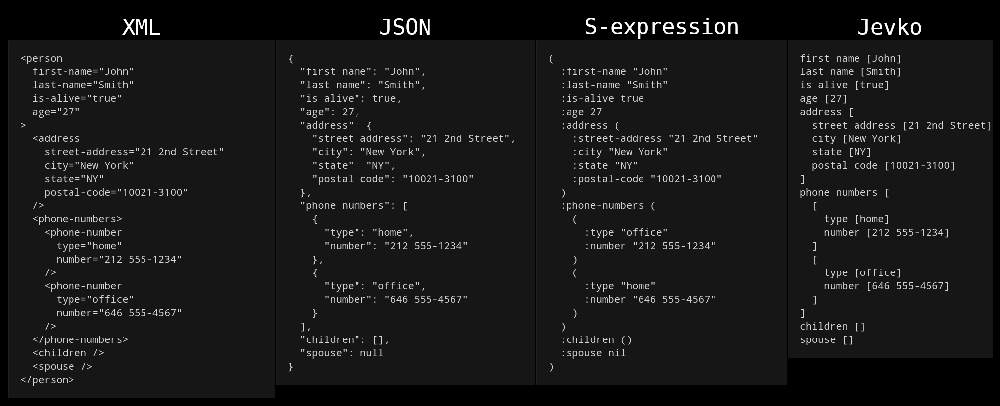

# Jevko: minimal syntax

**Jevko** is a minimal general-purpose syntax.

It can be used as a basic building block for simple and portable formats, languages, and notations in a variety of domains, such as data interchange, configuration, or text markup.

For example a data interchange format built on Jevko looks like this:

```
first name [John]
last name [Smith]
is alive [true]
age [27]
address [
  street address [21 2nd Street]
  city [New York]
  state [NY]
  postal code [10021-3100]
]
phone numbers [
  [
    type [home]
    number [212 555-1234]
  ]
  [
    type [office]
    number [646 555-4567]
  ]
]
children []
spouse []
```

## Comparison

Below is an illustration of how Jevko compares to other syntaxes in terms of compactness, simplicity, and human-readability.



## Formal grammar

The Standard Jevko Grammar is [specified here](https://github.com/jevko/specifications/blob/master/spec-standard-grammar.md).

## Demo

An interactive demonstration is of how Jevko can be used for data interchange is here:

[interjevko](interjevko.bundle.md)

## See also

[github.com/jevko](https://github.com/jevko)

[jevko.org](https://jevko.org)

## Attribution

The example of Jevko data shown here is based on an example piece of JSON from [Wikipedia](https://en.wikipedia.org/wiki/JSON#Syntax).

***

© 2022 [Jevko.org](https://jevko.org)
