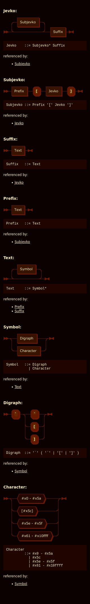

# Railroad diagrams and EBNF

The following railroad diagrams:



Were generated from this EBNF grammar:

```ebnf
Jevko ::= Subjevko* Suffix
Subjevko ::= Prefix Opener Jevko Closer

Opener ::= "["
Closer ::= "]"
Escaper ::= "`"
Delimiter ::= Escaper | Opener | Closer

Suffix ::= Text
Prefix ::= Text

Text ::= Symbol*
Symbol ::= Digraph | Character
Digraph ::= Escaper Delimiter
Character ::= #x0-#x5a | #x5c | #x5e-#x5f | #x61-#x10ffff
```

by [RR - Railroad Diagram Generator](https://www.bottlecaps.de/rr/ui) -- an awesome tool created by [Gunther Rademacher](https://github.com/GuntherRademacher).

An interactive version is [here](diagram/index.html) (warning: no dark mode).